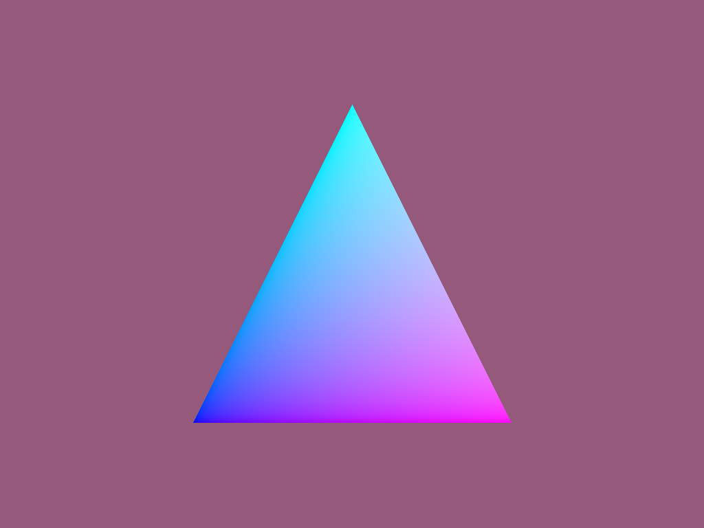

# PyOptiX

Python bindings for OptiX 7 - this branch also contains an experimental
implementation of an OptiX kernel written in Python, compiled with
[Numba](https://numba.pydata.org).


## Installation

### OptiX SDK

Install the [OptiX 7.3.0
SDK](https://developer.nvidia.com/optix/downloads/7.3.0/linux64).


### Conda environment

Create an environment containing pre-requisites:

```
conda create -n pyoptix python numpy conda-forge::cupy pybind11 pillow cmake numba
```

Activate the environment:

```
conda activate pyoptix
```

### PyOptiX installation

Build and install PyOptiX into the environment with:

```
export PYOPTIX_CMAKE_ARGS="-DOptiX_INSTALL_DIR=<optix install dir>"
pip3 install --global-option build --global-option --debug .
```

`<optix install dir>` should be the OptiX 7.3.0 install location - for example,
`/home/gmarkall/numbadev/NVIDIA-OptiX-SDK-7.3.0-linux64-x86_64`.


## Running the example

The example can be run from the examples directory with:

```
python examples/<example_name>.py
```

If the example runs successfully, the example output will be rendered:




Currently supported examples:
- hello.py
- triangle.py

## Explanation

The Python implementation of the OptiX kernel and Numba extensions consists of
three parts:

- Generic OptiX extention types for Numba. These include new types introduced in
the OptiX SDK. They can be vector math types such as `float3`, `uint4` etc. Or it
could be OptiX intrinsic methods such as `GetSbtDataPointer`. These are included in
examples/numba_support.py. We intend to build more examples by reusing these extensions.
- The second part are the user code. These are the ray tracing kernels that user
of PyOptiX will write. They are in each of the example files, such as `hello.py`,
`triangle.py`.
- Code that should be generated from the user's code - these tell Numba how to
  support the data structures that the user declared, and how to create them
  from the `SbtDataPointer`, etc. I've handwritten these for this example, to
  understand what a code generator should generate, and because it would have
  taken too long and been too risky to write something to generate this off the
  bat. The correspondence between the user's code and the "hand-written
  generated" code is mechanical - there is a clear path to write a generator for
  these based on the example code.
